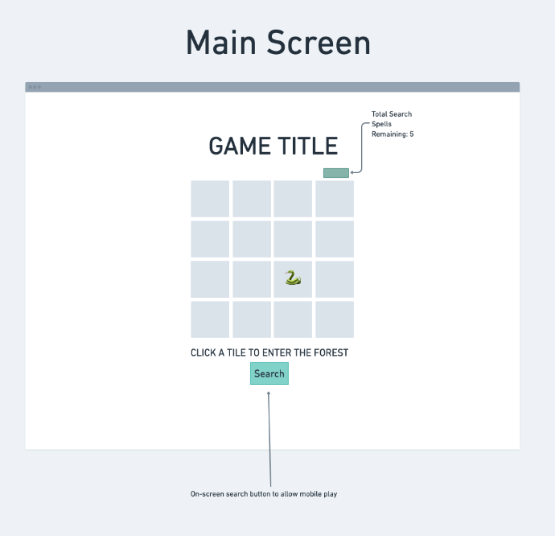
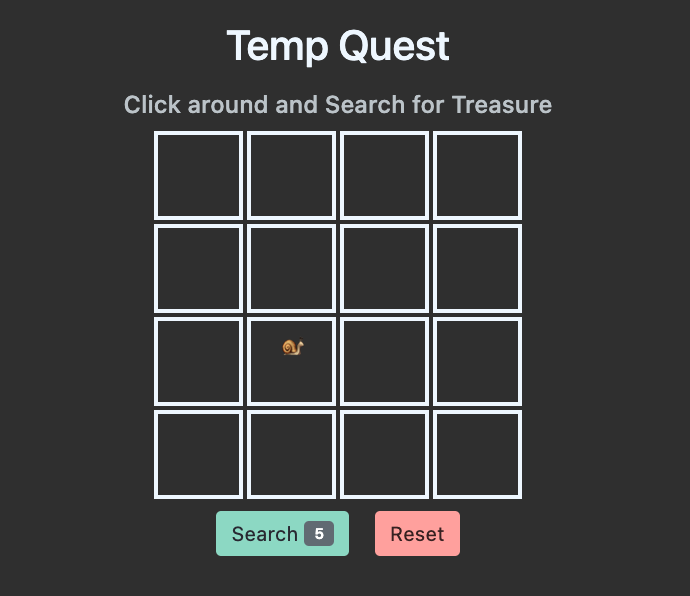
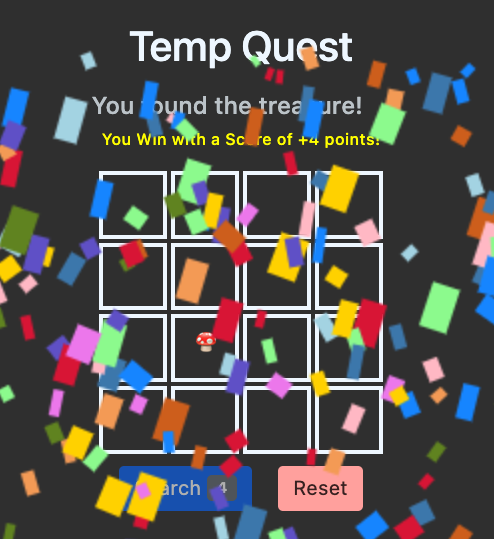

# Temp Quest

#### **To Play the Game**

Go [here!](vengeful-impulse.surge.sh)

#### **The Thought Process**

A peek at the wireframe and gameplay.

### **Technology Used** 

### **Credits**

- lose.mp3 (credit: [Epidemic Sound](https://www.epidemicsound.com/track/n31O3BxPsd/))
- move:search.mp3 (credit: [zapsplat](https://www.zapsplat.com/music/game-sound-designed-bubble-pop-17/))
- win.mp3 (credit: [Epidemic Sound](https://www.epidemicsound.com/track/Chh9DXAYKv/))
- confetti (credit: [ManliestBen](https://github.com/SEI-Remote/confetti))

### **Stretch Goals**

- Make the player character able to move only once -a cardinal direction- then Search. Continue to move from last Search position.
- Add a tile color change to indicate that the player is getting close to their treasure.
- Add origional art. 

